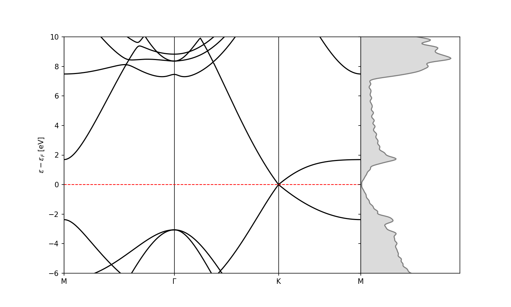
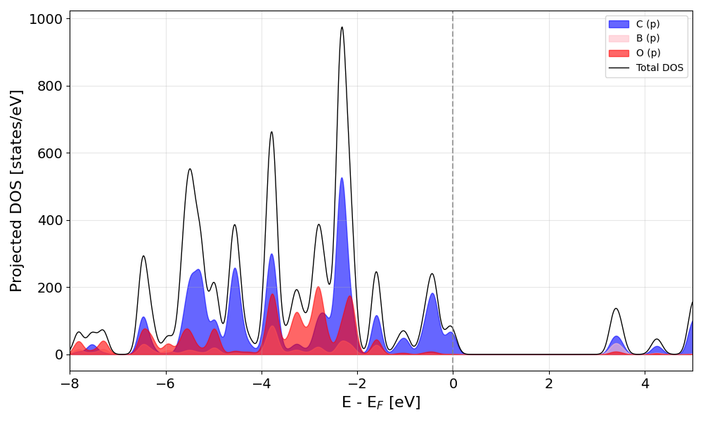

# cp2k scripts

Some additional tools to the [cp2k-output-tools](https://github.com/cp2k/cp2k-output-tools) for plotting band structures, total density of states, and projected density of states.

## Usage: cp2k_plot

There is a simple command-line interface `cp2kparse`:

```console
usage: cp2k_plot [-h] [--bs BS] [--dos DOS] [--ewin EWIN EWIN] [--figsize FIGSIZE FIGSIZE] [--dpi DPI]
                 [--sigma SIGMA] [--Fermi FERMI]

Analyze CP2K band structure and DOS.

options:
  -h, --help            show this help message and exit
  --bs BS               Path to the CP2K band structure file (project.bs)
  --dos DOS             Path to the CP2K DOS file (project.dos)
  --ewin EWIN EWIN      Energy window for plots (eV)
  --figsize FIGSIZE FIGSIZE
                        Figure size in cm (width, height)
  --dpi DPI             Figure resolution (DPI)
  --sigma SIGMA         Gaussian broadening parameter in Hartree
  --Fermi FERMI         Fixed Fermi energy (in eV). If not provided, it will be calculated from the band structure.
```

Passing only the `.bs` will plot the band structure only, if both `.bs` and `.dos` are passed, the total density of states is plotted adjacently to the right of the band structure, and if only the `.dos` file is passed, the total density of states is plotted alone with the energy axis on the abscissa. Notice that in the case of `.dos` only, the Fermi energy is unknown, so the plot is not aligned.

```console
$ cp2k_plot --dos graphene-1.dos --bs graphene.bs --ewin -6 10 --figsize 10 6


--- Band Structure Information ---
Total number of bands: 8
Number of valence bands: 4
Number of conduction bands: 4
Fermi Energy: -2.85 eV
Band Gap: 0.00 eV (Direct)
```



## Usage: cp2k_pdos

This script plots the projected density of states (pDOS) using the .pdos files generated by CP2K.
Note: As of CP2K version 2024.3, pDOS calculations are only supported for Γ-point calculations.

```console
usage: cp2k_pdos [-h] --filename-prefix FILENAME_PREFIX --num-elements NUM_ELEMENTS

Plot CP2K projected density of states (pDOS)

options:
  -h, --help            show this help message and exit
  --filename-prefix FILENAME_PREFIX
                        Prefix for PDOS files (e.g., 'COF-1-ALPHA' for files like COF-1-ALPHA_k1-1.pdos)
  --num-elements NUM_ELEMENTS
                        Number of constituent elements in the system


```

Each element and spin is written to a separate .pdos file, so the script requires the filename prefix and the number of elements as input when run from the command line:

```console
$ cp2k_pdos --filename-prefix COF-1-ALPHA --num-elements 4

```


